# Supported Patterns

## 4x4 Regular
-  Pattern id: `4_regular`

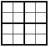

## 5x5 Cross
- Pattern id: `5_cross`

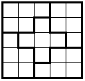

## 6x6 Brickwall
- Pattern id: `6_brickwall`

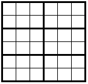

## 6x6 Ladder
- Pattern id: `6_ladder`

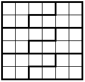

## 7x7 Diagonal
- Pattern id: `7_diagonal`

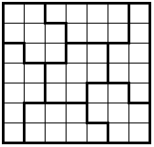

## 8x8 Brickwall
- Pattern id: `8_brickwall`

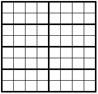

## 8x8 Ladder
- Pattern id: `8_ladder`

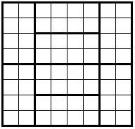

## 8x8 Cross `(WIP)`

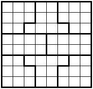

## 9x9 Regular
-  Pattern id: `9_regular`

## 10x10 Brickwall
- Pattern id: `10_brickwall`

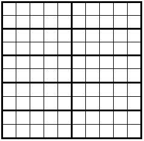

## 10x10 Ladder `(WIP)`

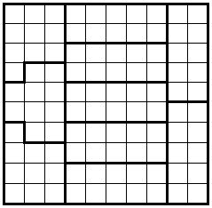

## 10x10 Ladder 2 `(WIP)`

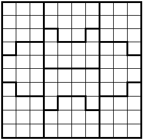

## 10x10 Diagonal `(WIP)`

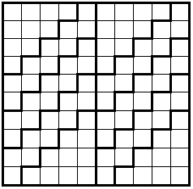

## 10x10 Diamond `(WIP)`

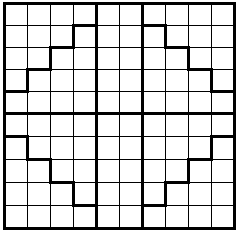

## 12x12 Cross `(WIP)`

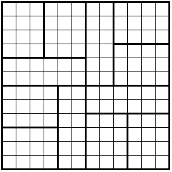

## 12x12 Short and Long `(WIP)`

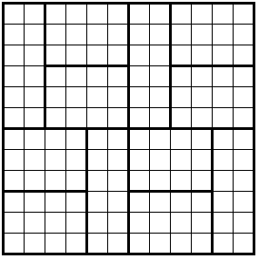

## 12x12 Ladder `(WIP)`

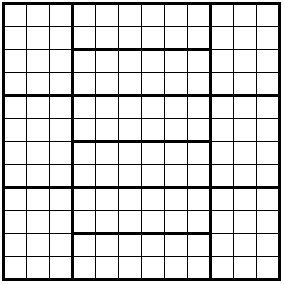

## 12x12 Brickwall
- Pattern id: `12_brickwall`

## 16x16 Regular
-  Pattern id: `16_regular`

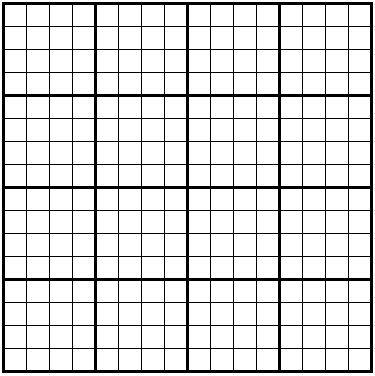
